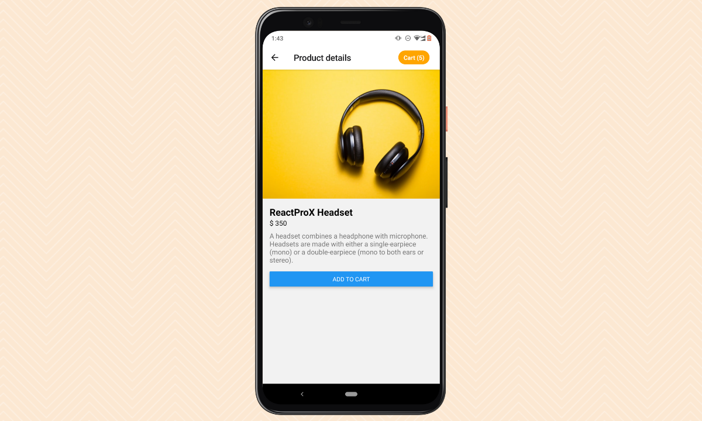
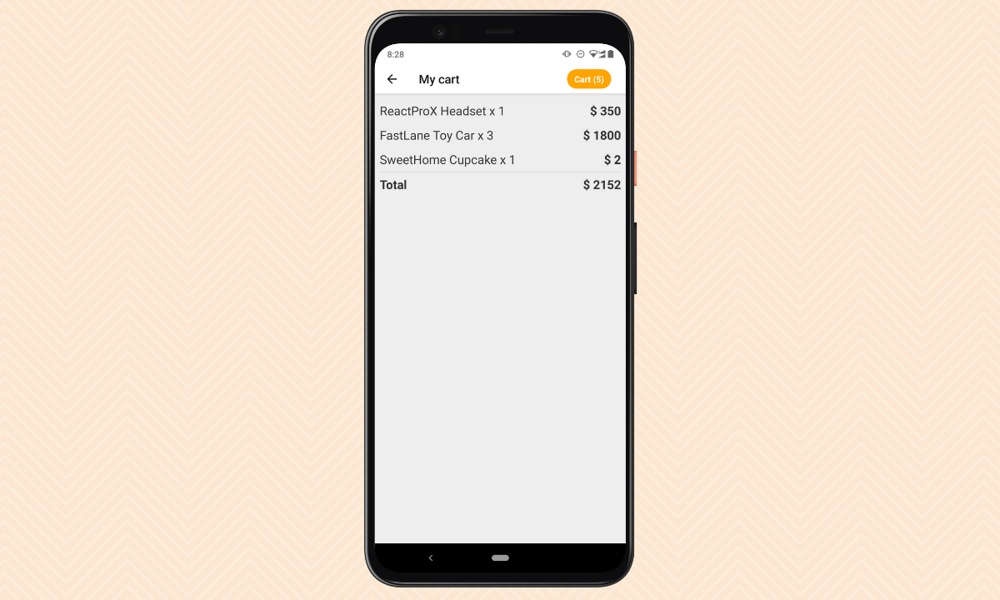

# UTS-PAM-2023
 14117139_Ade-Agam-Pratama

# ecommerce

Proyek ini menyediakan struktur proyek pemula minimal untuk aplikasi e-commerce.
Pada aplikasi akan muncul list products, kemudian user dapat menambah beberapa product ke dalam keranjang, setelah itu product tersebut dijumlahkan hasil dari keseluruhan products yang telah dimasukkan ke dalam keranjang.

- Layar: daftar produk, detail, dan ringkasan keranjang belanja.
- Manajemen status sederhana dengan React Context API.
- Mudah diperluas dengan fitur tambahan.
- Layanan API tiruan untuk data produk.
- Dibangun dengan [Expo](https://expo.dev).

## Sample Screens

### Products List

### Product Details

### Shopping Cart Summary

## Credits

- Sample screens design: [MockUPPhone](https://mockuphone.com) and [Canva](https://www.canva.com).
- Product images: [Unsplash](https://unsplash.com/)
